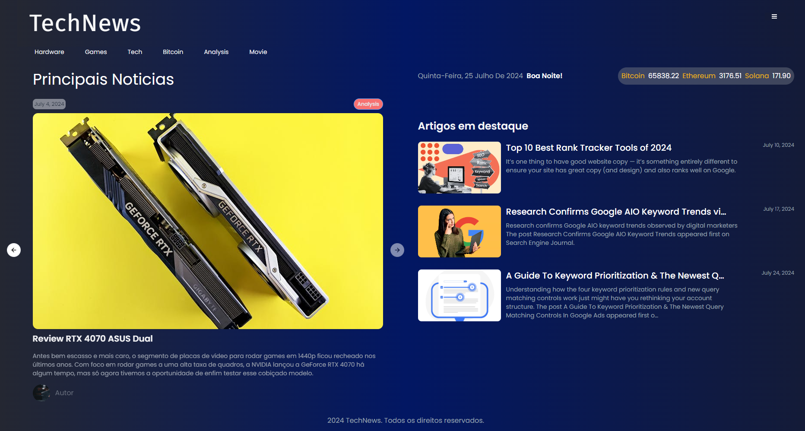
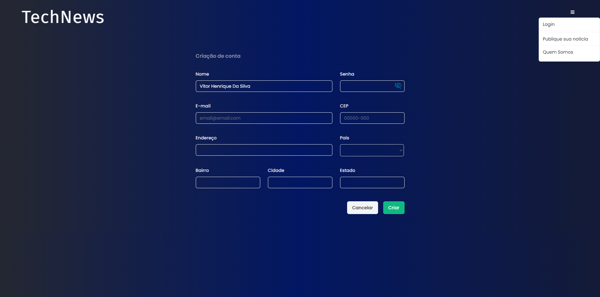

# News Tech	
**Meu projeto utilizando `VUE3` e `Laravel 11`**
Nele estou colocando em pratica os meu conhecimentos adquiridos no dia a dia.





## Como Utilizar Este Projeto Localmente?

### 1. Clonar o Repositório
Execute o seguinte comando para clonar o repositório:

```bash
git clone https://github.com/VitorHSilver/NewsTech.git
```

### 2. Instalar Softwares Necessários
Certifique-se de instalar os seguintes softwares:

**php 8.2 ou superior**

#### 2.1 -  Adicione o Repositório PPA do PHP:
```bash
sudo apt update
sudo apt install -y software-properties-common
sudo add-apt-repository ppa:ondrej/php
sudo apt update
```

#### 2.2 - Instale o PHP 8.2
```bash
sudo apt install -y php8.2
```
#### 2.3 - Instale Extensões Adicionais:

```bash
composer install
```
```bash 
composer update
```

